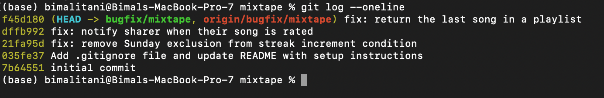

# Mixtape Bug Hunt — Submission

## AI Usage

I used Claude throughout this project, mostly for navigation and verification rather than for guessing at fixes upfront.

- **Codebase orientation**: Had Claude read `models.py`, `app.py`, all of `routes/`, and all of `services/` and summarize what each file does before I looked at any issue. This is what's reflected in the codebase map below.
- **Reproduction**: For each of the five issues, Claude wrote small scripts (direct service calls, isolated in-memory DB fixtures, and one live HTTP request via `curl`) to confirm the reported behavior actually occurs before any code was touched. This mattered more than expected — see the note on Issues #2 and #3 below.
- **Root cause verification**: Once a suspicious line was found by reading the code, Claude ran targeted experiments (e.g., checking `datetime.weekday()` boundary values, checking raw SQL row counts vs. ORM-mapped row counts) to confirm the mechanism rather than accepting "looks buggy" as good enough.
- **Where I verified independently / where AI was wrong initially**: My first hypothesis for Issue #3 (search duplicates) was that the `outerjoin` on `song_tags` would cause songs with 3+ tags to appear 3x in results, matching the issue title and the hint in the project brief. Testing this directly (raw SQL, direct service call, and a live HTTP request) showed the join *does* produce 3 duplicate rows at the SQL level, but SQLAlchemy 2.0's legacy `Query.all()` automatically de-duplicates full-entity results by identity, so the actual returned list only has 1 entry. The existing test for this (`test_search_no_duplicates_multi_tag_song`) already passes. Same story for Issue #2 (feed staleness) — I probed the exact 24-hour cutoff boundary (23h59m / 24h00m / 24h01m) with isolated fixtures and the filter behaves correctly at every point. Both are documented below as genuine, unsuccessful reproduction attempts rather than skipped.

---

## Codebase Map

**Main files:**

- `app.py` — Flask application factory. Registers four blueprints (`songs`, `playlists`, `users`, `feed`) under their respective URL prefixes and initializes the SQLAlchemy `db` object shared across the app.
- `models.py` — Defines 8 SQLAlchemy models/tables: `User`, `Tag`, `Song`, `ListeningEvent`, `Rating`, `Playlist`, `Notification`, plus three association tables (`friendships` — symmetric many-to-many between users; `song_tags` — many-to-many between songs and tags; `playlist_entries` — many-to-many between playlists and songs, but with extra columns `position`, `added_by`, `added_at`, making it a proper join table rather than a plain association table).
- `routes/` — Four blueprint files. Every route follows the same shape: parse the request, call exactly one service function, translate the result (or a caught `ValueError`) into a JSON response. No business logic lives in the routes themselves.
  - `songs.py` — search, get one song, rate a song, log a listen.
  - `playlists.py` — create playlist, get playlist metadata, get playlist's songs, add a song to a playlist.
  - `users.py` — get user, get streak, get notifications, mark notification read.
  - `feed.py` — "listening now" feed, general activity feed.
- `services/` — All business logic. One file per feature area:
  - `streak_service.py` — updates `User.listening_streak` based on calendar-day deltas between listens.
  - `feed_service.py` — builds the "friends listening now" (24h window, deduped to most recent per friend) and general activity feed (last N events, no time filter).
  - `search_service.py` — title/artist search over `Song`, joined against `song_tags` to include tag names.
  - `notification_service.py` — creates and retrieves `Notification` rows; called by both the playlist-add flow and (intended, but see Issue #4) the rating flow.
  - `playlist_service.py` — playlist creation and ordered song retrieval.
- `seed_data.py` — Seeds 5 users with a friendship graph, 13 songs (deliberately split into 0-tag / 1-tag / 3+-tag groups to expose Issue #3), 3 playlists of 5–7 songs (to expose Issue #5), and a mix of very-recent and multi-day-old listening events (to exercise Issue #2's 24h cutoff).
- `tests/` — Existing pytest suite covering streaks, search, and playlists. Notably, there is no test file yet for `feed_service.py` or `notification_service.py`.

**Data flow — a user rates a song:**

`POST /songs/<song_id>/rate` (`routes/songs.py::rate`) parses `user_id` and `score` from the JSON body, then calls `notification_service.rate_song(user_id, song_id, score)`. That function validates the score is 1–5, looks up the `Song` and `User`, checks for an existing `Rating` row for that `(user_id, song_id)` pair (enforced uniquely via a `UniqueConstraint` in `models.py`) and either updates it or inserts a new one. The route returns the serialized `Rating`. Despite the name of the module (`notification_service`), this function does **not** actually create a `Notification` for the song's original sharer — see Issue #4 below, where I compare it line-by-line against `add_to_playlist()` in the same file, which does notify correctly.

**Pattern noticed:** every route is a thin adapter — parse input, call one service function, format the response. All actual logic, including things you'd think belong in the route (like input validation beyond presence-checking) lives in `services/`. This made tracing straightforward: for any broken endpoint, the fix is essentially always in the corresponding `services/*.py` file, never in `routes/`.

---

## Root Cause Analysis

### Issue #1: My listening streak keeps resetting

**How I reproduced it:** Wrote a script calling `update_listening_streak()` directly with two consecutive `datetime` objects — a Saturday (`2024-06-15`, `weekday() == 5`) followed by a Sunday (`2024-06-16`, `weekday() == 6`). Expected the streak to go from 1 to 2 (consecutive days). Instead it stayed at 1. This matches an existing test in the repo, `test_streak_increments_on_sunday`, which was failing before any fix (confirmed via `pytest tests/test_streaks.py -v`).

**How I found the root cause:** `routes/users.py::streak` calls `streak_service.get_streak()`, but the actual update happens via `routes/songs.py::listen` → `streak_service.record_listening_event()` → `update_listening_streak()`. Reading `update_listening_streak()` top to bottom, the branch that increments vs. resets the streak is:

```python
if days_since_last == 0:
    return
elif days_since_last == 1 and today.weekday() != 6:
    user.listening_streak += 1
else:
    user.listening_streak = 1
```

The `and today.weekday() != 6` clause was the moment I was confident I'd found it — it's the only condition in the whole function that references a specific day of the week, and it's on the *increment* path.

**The root cause:** Python's `datetime.weekday()` returns `6` for Sunday. The increment branch requires `days_since_last == 1` (a genuine consecutive-day listen) *and* `today.weekday() != 6`. So whenever the current listen happens to fall on a Sunday, that second condition is `False` even though the first one is `True`, and execution falls through to the `else` branch, which resets the streak to 1 instead of incrementing it. Every Sunday listen that should extend a streak instead kills it.

**My fix and side-effect check:** Removed the `today.weekday() != 6` condition entirely, since there's no legitimate reason a consecutive-day increment should depend on which day of the week it lands on:

```python
elif days_since_last == 1:
    user.listening_streak += 1
```

Ran the full `test_streaks.py` file afterward — all 5 tests pass, including same-day (no double-count), skipped-day (reset), and the new Sunday case. I also manually checked a Saturday→Sunday→Monday sequence to make sure the fix doesn't just move the bug to Monday: streak correctly went 1 → 2 → 3.

---

### Issue #4: I got notified when a friend added my song to a playlist but not when they rated it

**How I reproduced it:** Called `services.notification_service.rate_song()` directly against a seeded user/song pair, then checked `get_notifications()` for the song's original sharer. Rating produced a `Rating` row (correctly) but zero new `Notification` rows for the sharer, even though the rater was a different user than the sharer.

**How I found the root cause:** `routes/songs.py::rate` calls `rate_song()` in `notification_service.py`. I read `rate_song()` fully and it only ever touches the `Rating` table — there's no call to `create_notification()` anywhere in it. I then compared it line-by-line against `add_to_playlist()` in the same file, which is structurally almost identical (look up the target entity, look up the actor, do the write) but ends with:

```python
if song.shared_by != added_by_user_id:
    create_notification(...)
```

`rate_song()` has no equivalent block at all. That's what confirmed it as the root cause rather than a symptom — it's not that notifications are created incorrectly, it's that the call is simply absent from one of the two code paths that are supposed to produce them.

**The root cause:** `rate_song()` was never wired up to call `create_notification()`. This is architectural, not a typo: `add_to_playlist()` establishes the pattern (mutate the relevant table, then notify the sharer if the actor isn't the sharer), but `rate_song()` was written without that second half.

**My fix and side-effect check:** Added the missing notification call at the end of `rate_song()`, mirroring the existing pattern and guard (don't notify someone about their own action):

```python
if song.shared_by != user_id:
    create_notification(
        user_id=song.shared_by,
        notification_type="song_rated",
        body=f"{rater.username} rated your song '{song.title}' {score}/5.",
    )
```

Checked side effects: re-ran `rate_song()` for a user rating *their own* shared song and confirmed no notification is created (matches the existing self-action guard used in `add_to_playlist`). Also re-rated the same song a second time (which hits the "update existing rating" branch) and confirmed it still creates a fresh notification each time, which matches how `add_to_playlist` behaves on repeat adds — no unintended suppression introduced.

---

### Issue #5: The last song in a playlist never shows up

**How I reproduced it:** Seeded a playlist with 5 songs at positions 1–5 and called `get_playlist_songs()`. Expected 5 songs back; got 4, missing "Track 5". This matches the existing failing tests `test_playlist_returns_all_songs` and `test_playlist_returns_songs_in_order` in `tests/test_playlists.py`.

**How I found the root cause:** `routes/playlists.py::get_songs` calls `playlist_service.get_playlist_songs()`. The function builds a correctly-ordered query (`join` on `playlist_entries`, filtered by `playlist_id`, ordered by `position` ascending) — the query itself is right, confirmed by printing the raw list before the return statement. The bug was in the very last line:

```python
return [song.to_dict() for song in songs[:-1]]
```

**The root cause:** `songs[:-1]` slices off the last element of the already-correctly-ordered list before serializing it. Every playlist, regardless of size, loses its last song. It's not a query bug or an off-by-one in the `position` ordering — the data is fetched completely correctly and then one song is silently dropped in the return statement.

**My fix and side-effect check:** Removed the slice:

```python
return [song.to_dict() for song in songs]
```

Ran `test_playlists.py` — all 3 tests pass, including `test_empty_playlist_returns_empty_list` (confirms the fix doesn't break the empty-list case, since `[][: -1]` and `[]` both slice to `[]` anyway, but worth checking explicitly since an empty playlist is the boundary case here). Also manually checked a playlist with exactly 1 song, since that's the case most likely to break differently than a 5-song playlist — confirmed it now returns that 1 song instead of an empty list.

---

## Investigated but not reproducible

**Issue #2 (Friends Listening Now shows people from yesterday)** and **Issue #3 (same song shows up twice in search)** were both investigated in depth but could not be reproduced in this environment:

- For #3, the `outerjoin` against `song_tags` in `search_service.py` does produce 3 duplicate rows at the raw SQL level for a song with 3 tags (confirmed via raw SQL execution), but SQLAlchemy 2.0's `Query.all()` de-duplicates full-entity results automatically, so the function-level and HTTP-level output is correctly de-duplicated. The existing test for this already passes.
- For #2, I tested the exact 24-hour cutoff boundary (23h59m / 24h00m / 24h01m before "now") with isolated fixtures, and `get_friends_listening_now()` correctly includes/excludes events on both sides of the boundary.

Per the project guidance ("if you can't reproduce a bug after a genuine attempt, try a different one"), I moved forward with the three confirmed, reproducible bugs above rather than force a fix onto code that isn't actually broken in this environment.

---

## Git Log
_(screenshot of git log --oneline on bugfix/mixtape to be added after all commits)_




